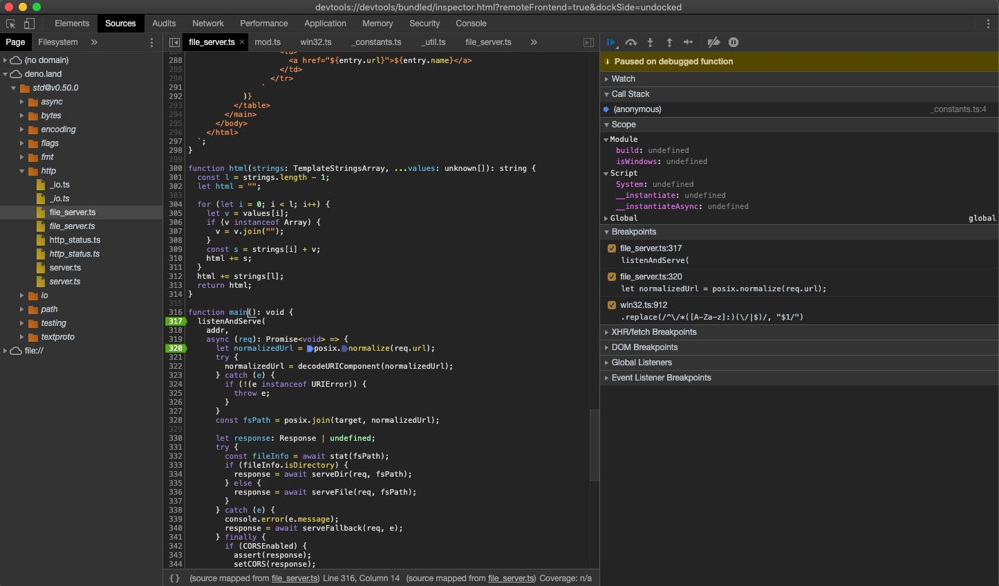

## 调试

Deno 支持 [V8 审查协议](https://v8.dev/docs/inspector)。


Chrome 开发者工具或者其他支持协议的客户端（如 VSCode）来进行调试。

运行Deno 的时候带上 `--inspect` 或 `--inspect-brk`来开启调试。

`--inspect` 允许及时在任何位置增加调试，而`--inspect-brk`会在第一行代码停止执行之后等待添加调试。

### Chrome 开发者工具

我们使用Chrome 开发者工具来调试个简单的程序；为了达到调试目的，我们使用`std`中的[file_server.ts](https://deno.land/std@v0.50.0/http/file_server.ts)，这是一个简单的静态文件服务器。

使用`--inspect-brk`标识让代码在第一行的时候停止执行。

```shell
$ deno run --inspect-brk --allow-read --allow-net https://deno.land/std@v0.50.0/http/file_server.ts
Debugger listening on ws://127.0.0.1:9229/ws/1e82c406-85a9-44ab-86b6-7341583480b1
Download https://deno.land/std@v0.50.0/http/file_server.ts
Compile https://deno.land/std@v0.50.0/http/file_server.ts
...
```

打开 `chrome://inspect` 然后点击靠近目标的 `Inspect`：


打开开发者工具之后，要加载所有的模块可能需要等待几秒钟的时间。


你可能注意到开发者工具在`_constants.ts` 而不是 `file_server.ts`的第一行代码位置暂停执行了。
这是在预料之中的，它是由 V8 执行ES模块的方式引起的（`_constants.ts`是`file_server.ts`最左边最底层的依赖，所以是第一个被执行的）。

这时候所有的源代码在开发者工具中都是可用的，所以我们可以打开`file_server.ts`增加断点了；到"Sources"面板去展开：


_仔细观察你会发现每行都有重复的；一行正常一行斜体。前者是源码编译的（因此`.ts`文件会生成JavaScript 代码），后者是这个文件的source map_

在`listenAndServe`方法中增加一个断点：



只要我们在开发者工具中增加断点就会自动打开source map文件，它允许我们一步步执行包括类型在内的真正代码。

让我们在开发者工具中发送一个请求然后检查：


```
$ curl http://0.0.0.0:4500/
```


这里我们可以思考请求的内容，然后一步步调试代码。


### VSCode

VSCode 可以调试 Deno。 

官方支持的插件 - https://github.com/denoland/vscode_deno/issues/12

设置 `launch.json` 配置文件也可以增加调试器：


```json
{
  "version": "0.2.0",
  "configurations": [
    {
      "name": "Deno",
      "type": "node",
      "request": "launch",
      "cwd": "${workspaceFolder}",
      "runtimeExecutable": "deno",
      "runtimeArgs": ["run", "--inspect-brk", "-A", "<entry_point>"],
      "port": 9229
    }
  ]
}
```

**说明**: 将 `<entry_point>` 替换为真正的脚本名。

这是我们创建一个本地的`server.ts`文件：


```ts
import { serve } from "https://deno.land/std@v0.50.0/http/server.ts";
const s = serve({ port: 8000 });
console.log("http://localhost:8000/");

for await (const req of s) {
  req.respond({ body: "Hello World\n" });
}
```

将 `<entry_point>` 改为 `server.ts` 然后执行创建的配置：


### 其他

所有实现了开发者工具协议的客户端都可以访问 Deno 进程。

### 限制

开发者工具目前仍不成熟，这些已知功能是缺失或者有bug的：

- 开发者工具控制台中的自动补充会导致Deno 程序退出
- 分析和内存转储可能会出现异常

